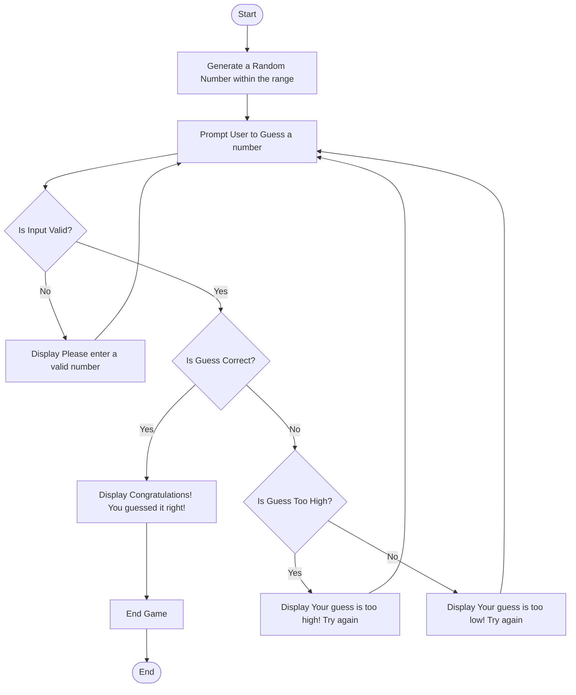

# Flowchart

# Description of Each Step

1. **Start:** The game begins when the player initiates it.
2. **Generate a Random Number:** The program generates a random number between 1 and 100.
3. **Prompt User for Guess:** The user is prompted to enter their guess.
4. **Check Input Validity:** If the input is invalid (non-numeric), the program displays an error message and prompts the user to try again.
5. **Check Guess:**
    - If the guess is correct, the program congratulates the user and ends the game.
    - If the guess is too high, it informs the user and prompts for another guess.
    - If the guess is too low, it also informs the user and prompts for another guess.
6. **End Game:** The game concludes once the user guesses correctly.
